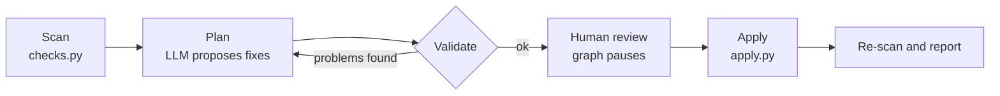

# Data Quality Auditor

An AI-assisted tool that finds problems in a messy dataset, proposes fixes, **waits for your approval**, applies only what you approved to a *copy* of the data, and then re-scans the result to prove it worked.

Built with LangGraph and LangChain.



## Why it's built this way

Letting an LLM loose on your data is risky. This project keeps the model on a short leash:

- **Detection is plain pandas, not an LLM.** The model reasons about issues that were *found*, never guesses at them.
- **The LLM proposes, code verifies.** Every proposed fix is checked against the real data: do the columns exist, are the values it wants to rename actually present, is every issue covered? A bad plan is bounced back with the exact reasons (a LangGraph retry loop).
- **Code decides what is "safe".** Only mechanical fixes (trim spaces, drop exact duplicates, placeholders to nulls, strip currency symbols) can be auto-approved. Anything that changes or deletes meaning always needs a human yes, whatever the model claims.
- **A real human gate.** The graph pauses with LangGraph's `interrupt()` and resumes with your decisions.
- **Applying fixes uses no LLM.** Fixes run in a fixed, safe order that does not depend on what order the model listed them in.
- **Your original file is never modified.** Output goes to a new `_clean.csv`, and the report is based on re-scanning that saved file.

## What it detects

| Check | Example |
|---|---|
| Duplicate rows | exact copies of an earlier row |
| Missing values | empty cells |
| Hidden placeholders | `N/A`, `null`, `-`, `not recorded` pretending to be data |
| Stray whitespace | `"Delhi "` |
| Numbers stored as text | `"₹1,999"` |
| Non-numeric junk in numeric columns | `"abc"` in an amount column |
| Invalid dates | `31/02/2024` |
| Category spelling variants | `Mumbai` / `MUMBAI` |
| Outliers | values beyond 3x the interquartile range |
| Impossible negatives | negative quantity or price |
| Constant columns | a column with a single value |

Variants that are different *words* for the same thing (for example `bangalore` vs `Bengaluru`) cannot be caught by a string rule. That is where the LLM step earns its place: it sees the distinct values of each text column and proposes the mapping.

## What it can fix

`drop_duplicate_rows`, `strip_whitespace`, `placeholders_to_null`, `convert_numeric`, `parse_dates`, `standardize_values`, `fill_missing`, `nullify_values`, `drop_column`, `no_action`.

The model can only choose from this fixed list.

## Project layout

| File | Role |
|---|---|
| `checks.py` | Step 1: deterministic scanner. Runs on its own: `python checks.py data.csv` |
| `planner.py` | Step 2: the fix vocabulary, the LLM prompt, and the plan validator |
| `graph.py` | Step 2: scan, plan, validate loop. Also holds `get_llm()` (provider selection) |
| `audit.py` | Step 3: adds the human approval gate. Writes `approved_plan.json` |
| `apply.py` | Step 4: applies approved fixes, re-scans, writes the report |
| `make_messy_data.py` | Generates `messy_orders.csv`, a deliberately dirty sample dataset |

## Setup

Requires Python 3.10 or newer.

```bash
pip install -r requirements.txt
```

Reading Excel files needs `openpyxl` (included in `requirements.txt`).

### Choose an LLM provider

The default is **Groq**, which has a free tier that does not require a credit card. Set the key for the provider you use.

**Windows (PowerShell):**
```powershell
$env:GROQ_API_KEY="your-key"
```

**macOS / Linux:**
```bash
export GROQ_API_KEY="your-key"
```

| Provider | Key variable | Extra settings |
|---|---|---|
| Groq (default) | `GROQ_API_KEY` | none |
| Google Gemini | `GOOGLE_API_KEY` | `LLM_PROVIDER=gemini` and `pip install langchain-google-genai` |
| Anthropic Claude | `ANTHROPIC_API_KEY` | `LLM_PROVIDER=anthropic` and `pip install langchain-anthropic` |

Set `LLM_MODEL` to override the model name. Hosted model names are retired fairly often, so if you get a "model not found" error, pick a current one from the provider's model list.

Never commit API keys. Set them in your terminal session, not in files.

## Usage

Try it on the included sample data first.

**1. Scan only (no API key needed):**
```bash
python checks.py messy_orders.csv
```

**2. Plan fixes and approve them:**
```bash
python audit.py messy_orders.csv
```
You will see the safe fixes that are pre-approved, then each fix that needs your decision, with the problem, the reason, and any exact renames. Answer `y` (approve), `n` (reject), `a` (approve all remaining), or `q` (reject all remaining). This writes `approved_plan.json`.

**3. Apply (no API key needed):**
```bash
python apply.py
```
This writes `messy_orders_clean.csv` and `cleaning_report.txt`.

### Example result on the sample data

```
Rows: 1,030 -> 1,000    Columns: 8 -> 7
BEFORE -> AFTER   (13 issues before, 4 after; re-scanned from the saved file)
  [ok] resolved   category_variants on city (200)
  [ok] resolved   duplicate_rows on whole table (30)
  [ok] resolved   numeric_formatting on amount (21)
  [ok] resolved   invalid_dates on order_date (13)
  [ok] resolved   outliers on quantity (6)
  ...
```

The remaining items are honest gaps: placeholders and impossible values became real empty cells instead of being replaced with invented data. What to do about them (leave, fill, or collect the data) is your decision.

## Privacy

The LLM never receives your full dataset, but it does receive a summary: the detected issues with example values, the distinct values (with counts) of each text column that has 40 or fewer distinct values, and sample values for the rest. Do not run confidential or personal data through a free-tier API, because providers may use free-tier traffic to improve their products. Check your provider's terms.

## Limitations

- The whole file is loaded into memory, so very large datasets are not supported.
- Dates are parsed with a year-first assumption, then a best guess for other formats. Ambiguous day/month formats (`03/04/2024`) can be read wrongly, and the report warns when a guess was needed.
- The outlier rule (3x IQR) is a heuristic. A genuine bulk order can look like an outlier, which is why nullifying values always needs your approval.
- The pause between planning and approval is held in memory, so it does not survive restarting the program.
- LLM output varies between runs, and small free-tier models sometimes miss an issue on the first attempt. The validator catches this and retries up to three times.
- There is no automated test suite yet.
